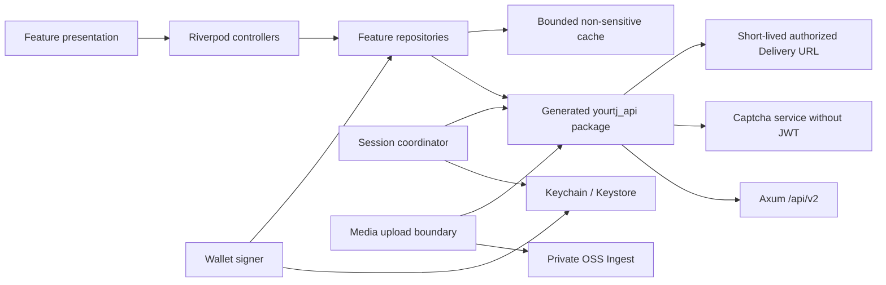
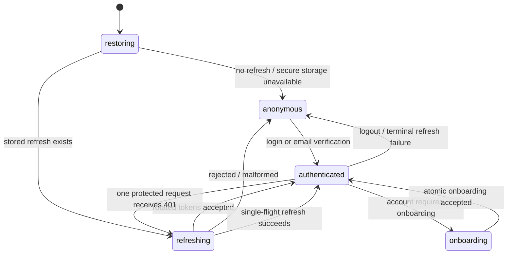

# Flutter 移动端架构与信任边界

> 文档类型：架构规范
>
> 状态：Active
>
> 负责人：Mobile maintainers、Platform maintainers、Security maintainers
>
> 最近核验：2026-07-14，Flutter 3.44、OpenAPI Generator 7.22 与 Web/API 运行边界

本文说明 monorepo 内 `mobile/` 如何消费平台能力。产品旅程、布局和 parity 门槛见
[Flutter 移动端产品规范](../product/mobile-client.md)；本文只定义代码边界、生成链路、状态所有权和
客户端信任边界。

## 运行边界



PostgreSQL 和 owner-domain API 始终是业务事实源。Flutter 本地状态分三类：

| 类型 | 例子 | 规则 |
|---|---|---|
| 内存会话状态 | access token、当前 Account、appeal/recovery credential、signed media URL | 账号/credential generation 改变即清空，不进入日志或普通磁盘 |
| 系统安全存储 | refresh token、Ed25519 seed、active account pointer | fail closed；按环境和 account namespace；禁止云备份与普通存储降级 |
| 有界非敏感缓存 | 公开课程、板块、feed 摘要、本机课表、installation UUID | schema version + TTL；按环境/账号分区；只作启动与 stale 展示 |

## 工程结构

```text
mobile/
  lib/
    app/                    bootstrap、router、adaptive shell
    core/
      api/                  Dio、生成 API composition、error mapping
      config/               compile-time environment 与 trusted origins
      design_system/        Web-derived tokens、theme、shared states/components
      routing/              canonical route IDs、deep-link allowlist、guards
      security/             secure storage、session、wallet signer
      storage/              非敏感 versioned account-scoped cache
    features/
      <domain>/
        data/               repository 与 local/remote adapters
        domain/             客户端纯逻辑；不复制服务器业务规则
        presentation/       provider/controller/page/widgets
  packages/yourtj_api/      从 contract/openapi.yaml 生成，禁止手改
  test/                     unit/widget/golden 与 shared fakes
  integration_test/         跨页面真实客户端旅程
  tool/                     codegen 与 drift check
```

Feature 不直接创建 Dio、读 secure storage 或访问另一个 feature 的私有文件。跨 feature 跳转使用 route
ID；跨域业务组合由小的 app-level use case 调用各 repository，不让页面拼 raw HTTP。`core` 不拥有课程、
论坛或积分业务状态，生成 package 也不承载 session/retry policy。

## OpenAPI 生成链路

`contract/openapi.yaml` 是 wire contract。Dart package 使用 OpenAPI Generator `7.22.0` 的稳定
`dart-dio` generator 与 `json_serializable`：

- generator jar SHA-256 固定为
  `3f1e6ce5c6ad4f15242c6170ab43aad4bad771622617eeece4a7d4f72ffaf329`；脚本下载后先校验。
- Dart serialization 选择 `json_serializable`。当前 `built_value` generator 会在平台的通用
  `Page.items: array<object>` 上失败，不能把生成崩溃误当成 contract 可省略。
- 启用 unknown enum fallback，避免服务端 additive enum 让旧 App 全页反序列化失败；UI 仍把 unknown
  显示成保守的“未知状态”，不能当成功。
- 关闭 generator copy-with 扩展，减少无业务价值的 runtime/build dependency。
- package language version 与移动端 Dart 3.12 对齐；运行 build_runner 生成 serializer 后再 format/fix。
- generator 的 path-derived 方法名只留在 repository 内；UI 不依赖它们。未来添加稳定 `operationId`
  必须作为全 contract 的受控命名变更，不能零散添加造成 SDK 抖动。

生成脚本输出到临时目录，再以完整目录替换 `mobile/packages/yourtj_api/lib`；手工 package metadata 和
生成器配置分别受控。CI 重新生成并要求 git diff 为空。生成文件顶部标明不可手改；任何为“让 Flutter
先跑”而在模型中放宽类型的修复必须回到 OpenAPI/Rust/Web。

## API composition 与错误

一个 App environment 只有一个平台 Dio 实例，base URL 来自 compile-time define。Release 只接受
HTTPS；debug 可显式允许 loopback/emulator 的 HTTP，不能接受任意 host。API、captcha、OSS、CDN 与
外链使用不同 client：

- 平台 JWT 只在 request URL 的 origin 与配置 API origin 完全匹配，且 operation 声明 bearer 时添加。
- captcha 不携带 JWT、refresh、wallet header 或 platform cookies。
- OSS 只接收当次 STS/V4/callback 所需 header，绝不接收 Authorization bearer。
- CDN signed URL 使用无认证图片 client；不把签名 URL写日志或持久缓存。
- 外部 HTTPS 链接交给系统浏览器前经过 scheme/host/route policy，不在 App client 中自动抓正文。

所有非 2xx 统一映射为 `AppFailure`：优先解析平台 `{error: {code, message, details}}`，保留 bounded code
供 UI 选择恢复路径，不保存 raw body、DB 字符串或含 credential 的 request。Transport、timeout、offline、
unauthorized、forbidden/recent-auth、not-found、conflict、rate-limit 和 service-unavailable 可区分。页面不
捕获 DioException 并自行猜文案。

默认不做 timeout/5xx 自动 retry。GET 的用户触发 retry 会重建请求；mutation 只在 repository 明确拥有
idempotency key 和恢复语义时重试。积分 value-moving mutation 永不因通用 interceptor 重放。

## Session state machine



Session coordinator owns monotonically increasing generation。每次登录、refresh terminal failure、登出、
账号切换或 recovery/appeal mode 切换都增加 generation，取消旧 CancelToken，并拒绝迟到响应写入新状态。

- access token 只在内存；refresh token 每次 rotation 后先写 secure storage，再发布 authenticated state。
- 同一进程最多一个 refresh Future；其他 401 等待它并只重放一次原请求。
- refresh endpoint 使用独立无 session interceptor 的 Dio，避免递归。
- 正常、appeal-only 与 recovery credential 是互斥 namespace 和 router shell；受限 credential 不可被
  generated client 自动当普通 bearer 使用。
- logout 尽力通知服务器；无论网络结果如何都清本机 credential。`logout-all` 成功后清所有本机账号。
- installation UUID 不是认证 secret；它可在正常登出后保留，但不跨 App reinstall 恢复，不参与广告追踪。

## 钱包签名边界

钱包 signer 是 session 之外的独立组件。seed key 使用 `environment + accountId + keyVersion` namespace；
普通 repository 只能请求“对这段服务端 exact signing bytes 签名”，不能读取 seed。

1. 从 `credit/signing-intents` 取得 `intentId`、`signingBytes` 与 expiry。
2. 验证 intent 未过期、当前账号与待执行 action 未变化。
3. 以 UTF-8 exact bytes 计算 Ed25519 signature，base64 编码；不 parse/re-serialize signing bytes。
4. 同一请求携带 intent、`X-Wallet-Sig` 与同一 idempotency key。
5. 收到不确定网络结果时先查询 canonical transaction/state，不再次创建 intent 或盲重放。

生成、签名、清除和 public-key derivation 使用跨端黄金向量测试。日志、Crash report、clipboard、deep link、
analytics 和普通 cache 永远不包含 seed、signature credential 或 signing bytes。Android backup rules 与 iOS
Keychain accessibility 必须接受真机验证；插件异常直接阻止钱包/登录，不回退。

## Route 与状态恢复

Canonical route table 覆盖 Web 的用户 route 语义；mobile route 可以使用不同 presentation，但 deep link
必须解析成同一 domain ID。Route parser 只接受：

- App 内相对 route；
- `yourtj://` 的已知 host/path；
- 配置域名的 HTTPS universal/app link。

未知 path 进入安全 Not Found，未知 query 被丢弃；`next` 只能指向 allowlist 内部 route。tab 使用
StatefulShellRoute 保留独立栈。路由只保存公开 ID、筛选与分页位置，不把 token、email、reason、媒体 key
或签名放进 URL/restoration state。

## 本地课表

课程级课表是明确的客户端 owner，不回写教务系统。持久化 key 至少包含 environment、account/anonymous、
calendar 与 schema version；记录 canonical course ID/code 和显示快照，恢复时重新请求课程/timeslot facts。
冲突检测是纯函数，按 weekday 与 inclusive slot range；weeks 缺失按可能冲突处理。教学班模型未进入统一
contract 前，不在本地保存伪 teaching-class identity。

## 测试替身与可观测性

- Repository tests 使用 Dio adapter/fake server 返回真实 JSON shape，不 mock generated model getter。
- Secure storage、clock、UUID 和 wallet algorithm 通过窄接口注入；生产实现不携带 test-only helper。
- Widget tests override repository/provider，验证用户可见行为、semantics 和取消/恢复，不验证 Riverpod
  implementation detail。
- Integration tests 连接本地专用 test environment；不连接 staging/production，不访问真实 email/OSS。
- 客户端日志只有 lifecycle、route ID、HTTP method、path template、status、request ID 和 bounded error code；
  不记录 query、body、email、token、签名、媒体 URL/key 或私信内容。

Crash/analytics provider 尚未形成隐私、retention、export/delete 和 consent 决策，因此为
`Decision needed`。在决定前不集成第三方追踪 SDK；本地 debug 日志也遵循同一 redaction 规则。
