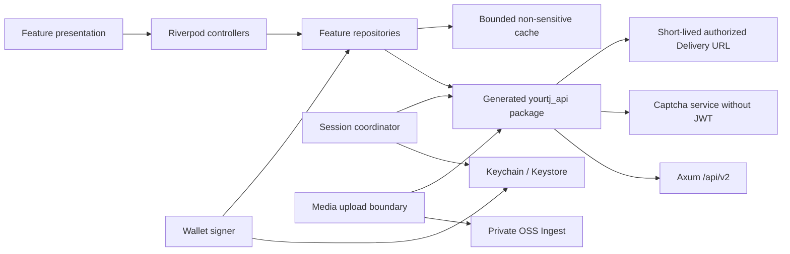
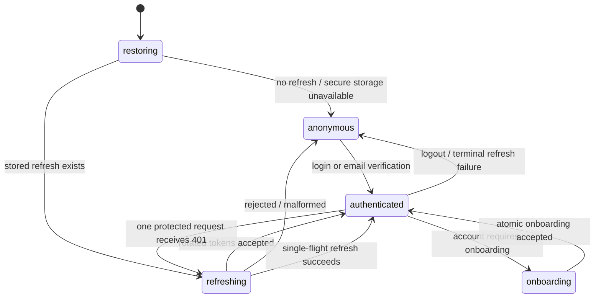

# Flutter 移动端架构与信任边界

> 文档类型：架构规范
>
> 状态：Active
>
> 负责人：Mobile maintainers、Platform maintainers、Security maintainers
>
> 最近核验：2026-07-14，Flutter 3.44、当前目录/生成链路、secure pending reconciliation 与 Web/API 边界

本文说明 monorepo 内 `mobile/` 如何消费平台能力。产品旅程、布局和 parity 门槛见
[Flutter 移动端产品规范](../product/mobile-client.md)；本文只定义代码边界、生成链路、状态所有权和
客户端信任边界。

## 运行边界



PostgreSQL 和 owner-domain API 始终是业务事实源。Flutter 本地状态分三类：

| 类型 | 例子 | 规则 |
|---|---|---|
| 内存会话状态 | access token、当前 Account、appeal/recovery credential、signed media URL | 账号/credential generation 改变即清空，不进入日志或普通磁盘 |
| 系统安全存储 | versioned active-session record（account id + refresh token）、Ed25519 seed、待核验积分操作 | fail closed；按环境和 account namespace；禁止普通存储降级。iOS seed 要求设备密码；session 与 pending 为 ThisDeviceOnly key，不同步或迁移到另一设备 |
| 设备本地 no-backup 状态 | installation UUID | 按环境分区；可跨正常登出，卸载即清除；Android backup rules 与 iOS excluded-from-backup 文件均禁止迁移，不参与认证或追踪 |
| 有界非敏感缓存 | 公开课程、板块、feed 摘要、本机课表 | schema version + TTL；按环境/账号分区；只作启动与 stale 展示 |
| 短时 owner-export staging | Android 仅内存字节与用户选择的 SAF URI；iOS `tmp` 下受保护的随机子目录 | 16 MiB；account id + session generation 绑定；成功/取消/错误清理，iOS 冷启动重扫 orphan；不进入 cache、backup、日志或剪贴板 |

## 工程结构

```text
mobile/
  lib/
    app/                    bootstrap、router、adaptive shell
    core/
      config/               compile-time environment 与 trusted origins
      content/              plain/Markdown 安全 renderer
      design/               Web-derived tokens 与 theme
      l10n/                 集中用户文案
      layout/               adaptive shell 与 breakpoints
      navigation/           destination、外链与 deep-link policy
      network/              Dio session policy、error mapping
      storage/              installation 等有界非敏感状态
      validation/           跨页面输入边界
      widgets/              shared loading/empty/error/avatar components
    features/
      <domain>/
        data/               repository 与 local/remote adapters
        domain/             客户端纯逻辑；不复制服务器业务规则
        presentation/       provider/controller/page/widgets
  packages/yourtj_api/      从 contract/openapi.yaml 生成，禁止手改
  test/                     unit/widget、contract corpus 与 shared fakes
scripts/
  generate_mobile_api.sh    仓库根目录的固定版本/校验和生成与 drift 入口
```

当前没有 `mobile/tool/` 或 `mobile/integration_test/`；也没有已提交的 golden。跨页面真实环境 journey 和
设计 golden 是明确的质量缺口，不能用普通 widget test 目录代替。Session/secure storage/wallet 实现位于
其 owning feature 的 `data/`，而不是虚构一个尚不存在的 `core/security/`。

Presentation/controller 不直接创建 Dio、读 secure storage 或访问另一个 feature 的私有文件。Session 与
wallet 的 secure-storage adapter 由各自 owning feature 的 `data/` 实现并通过 app-level provider 注入；
其他 feature 只调用窄接口。跨 feature 跳转使用 route ID；跨域业务组合由小的 app-level use case 调用
各 repository，不让页面拼 raw HTTP。`core` 不拥有课程、论坛或积分业务状态，生成 package 也不承载
session/retry policy。

## OpenAPI 生成链路

`contract/openapi.yaml` 是 wire contract。Dart package 使用 OpenAPI Generator `7.22.0` 的稳定
`dart-dio` generator 与 `json_serializable`：

- generator jar SHA-256 固定为
  `3f1e6ce5c6ad4f15242c6170ab43aad4bad771622617eeece4a7d4f72ffaf329`；脚本下载后先校验。
- Dart serialization 选择 `json_serializable`。当前 `built_value` generator 会在平台的通用
  `Page.items: array<object>` 上失败，不能把生成崩溃误当成 contract 可省略。
- 启用 unknown enum fallback，避免服务端 additive enum 让旧 App 全页反序列化失败；UI 仍把 unknown
  显示成保守的“未知状态”，不能当成功。
- 关闭 generator copy-with 扩展，减少无业务价值的 runtime/build dependency。
- package language version 与移动端 Dart 3.12 对齐；运行 build_runner 生成 serializer 后再 format/fix。
- generator 的 path-derived 方法名只留在 repository 内；UI 不依赖它们。未来添加稳定 `operationId`
  必须作为全 contract 的受控命名变更，不能零散添加造成 SDK 抖动。

仓库根目录的 `scripts/generate_mobile_api.sh` 输出到临时目录，再以完整目录替换
`mobile/packages/yourtj_api/lib`；手工 package metadata 和生成器配置分别受控。CI 重新生成并要求
git diff 为空。生成文件顶部标明不可手改；任何为“让 Flutter 先跑”而在模型中放宽类型的修复必须
回到 OpenAPI/Rust/Web。

## API composition 与错误

一个 App environment 只有一个平台 Dio 实例，base URL 来自 compile-time define。Release 只接受
HTTPS；debug 可显式允许 loopback/emulator 的 HTTP，不能接受任意 host。API、captcha、OSS、CDN 与
外链使用不同 client：

- 平台 JWT 只在 request URL 的 origin 与配置 API origin 完全匹配，且 operation 声明 bearer 时添加。
- 平台与 captcha Dio 禁止自动 redirect；需要跳转的无凭证公开流程必须显式校验每一跳 origin 后另发请求。
- captcha 不携带 JWT、refresh、wallet header 或 platform cookies。
- OSS 只接收当次 STS/V4/callback 所需 header，绝不接收 Authorization bearer。
- CDN signed URL 使用无认证图片 client；不把签名 URL写日志或持久缓存。Avatar/banner widget 只请求
  当前 App environment 配置的 API origin 或 `YOURTJ_MEDIA_CDN_BASE_URL` 精确 origin，拒绝 sibling host、
  credential、fragment 和任意第三方 HTTPS URL；服务端 owner-domain 授权仍是主边界，客户端 allowlist
  只是 defense-in-depth。
- 外部 HTTPS 链接交给系统浏览器前经过 scheme/host/route policy，不在 App client 中自动抓正文。

所有非 2xx 统一映射为 `AppFailure`：优先解析平台 `{error: {code, message, details}}`，保留 bounded code
供 UI 选择恢复路径，不保存 raw body、DB 字符串或含 credential 的 request。Transport、timeout、offline、
unauthorized、forbidden/recent-auth、not-found、conflict、rate-limit 和 service-unavailable 可区分。页面不
捕获 DioException 并自行猜文案。

默认不做 timeout/5xx 自动 retry。401 refresh 后通用 interceptor 只自动重放 GET/HEAD/OPTIONS；mutation
只在 repository 明确拥有稳定 idempotency key 和恢复语义时自行处理。积分 value-moving mutation 永不因
通用 interceptor 重放。

## Owner export 平台保存边界

Settings-domain workflow 在列 job 时捕获 account id + session generation，创建、recent-auth、grant、下载和
平台保存的每个 await 前后都校验同一 snapshot。Session stream 变化会清空旧 job metadata，并通过独立
`cancelAccountExport` channel 终止正在等待的 picker/write；因此新账号的 bearer 不会请求旧账号 job，旧
payload 也不会在切号后继续得到“保存成功”。MethodChannel 只接受固定文件名、非空且不超过 16 MiB 的
UTF-8 bytes，Dart 在跨平台边界前还严格验证 export schema/sections 和 JSON object shape。

Android 使用 `ACTION_CREATE_DOCUMENT`，取得 URI 后由单线程 writer 分块直写 `ContentResolver`，不创建
App-owned plaintext file。内存副本在成功、取消、失败或 Activity destroy 后清零；取消/失败会尽力删除
已创建的目标，删除不能确认时只返回固定错误，不披露 URI。iOS 先在唯一 `tmp` 子目录写入 mode-`0600`、
`Complete` protection、exclude-from-backup 的固定名文件，再用 `UIDocumentPickerViewController` 导出 copy；
delegate 成功、取消、错误均删除该目录，冷启动删除进程终止遗留的整个 staging root。两平台只有系统
确认写入/导出完成后才返回 `saved`，页面不渲染 JSON 全文。

## Session state machine



Session coordinator owns monotonically increasing generation。每次登录、refresh terminal failure、登出、
账号切换或 recovery/appeal mode 切换都增加 generation，并拒绝迟到响应写入新状态；搜索、课程等高频
controller 另外持有并取消自己的 `CancelToken`，当前不存在一个能物理取消全部 generated request 的全局 token。

- access token 只在内存；account id 与 refresh token 作为一条 versioned secure-storage
  record 原子替换，每次 rotation 只有该单次关键写成功后才发布 authenticated state。旧版分离
  pointer/token 在首次读取时先写新 record，再尝试清理；清理失败不能把已提交会话误报为未保存。
  iOS 使用 `AfterFirstUnlockThisDeviceOnly` 且关闭 synchronizable：不会进入 iCloud Keychain 或迁移到另一
  设备，但 Apple 的同设备加密 backup/restore 语义仍需真机验证；服务端 session 撤销是最终控制面。
- 同一进程最多一个 refresh Future；其他可安全重放的 401 等待它并只重放一次原请求。
- refresh endpoint 使用独立无 session interceptor 的 Dio，避免递归。
- 正常、appeal-only 与 recovery credential 是互斥 namespace 和 router shell；受限 credential 不可被
  generated client 自动当普通 bearer 使用。
- logout 尽力通知服务器并清本机 credential。清理异常时当前进程立即停止使用凭据，
  但 UI 必须明示持久凭据未确认删除，不得宣称已完成本机登出；`logout-all` 同样遵守该边界。
- installation UUID 不是认证 secret；它可在正常登出后保留，但不跨 App reinstall 恢复，不参与广告追踪。

## 媒体上传 owner 边界

`MediaUploader` 的调用方在打开系统文件选择器前捕获 authenticated account id 与 session generation，
并将这对 owner token 显式传过整个上传。文件长度/内容读取、hash、上传凭据签发、OSS V4 签名、带 callback
的 PutObject 响应以及最终 `onUploaded` 交付都在 await 前后重验当前 owner；任一阶段登出、账号切换或
generation 变化都会 fail closed。OSS callback 已可能为旧账号形成 canonical upload fact，客户端因此不能
撤销该事实或改绑 owner，只能拒绝把迟到 upload id 送入新 session 的编辑器；后续 orphan/retention 仍由
Media domain 处理。

## 钱包签名边界

钱包 signer 是 session 之外的独立组件。seed key 使用 `environment + accountId + keyVersion` namespace；
普通 repository 只能请求“对这段服务端 exact signing bytes 签名”，不能读取 seed。

首次登记 public key 前，客户端调用 Identity recent-auth flow；服务器按当前 revocable session freshness
授权，并只接受数据库唯一 active key 的首次写入或同 key 幂等确认。不同 key 不在客户端自动覆盖，
也不因 secure storage 中缺 key 而生成“替代恢复”请求；old-key proof/审计恢复协议交付前直接 fail closed。

1. 从 `credit/signing-intents` 取得 `intentId`、`signingBytes` 与 expiry。
2. 验证 intent 未过期、当前账号与待执行 action 未变化。
3. 以 UTF-8 exact bytes 计算 Ed25519 signature，base64 编码；不 parse/re-serialize signing bytes。
4. 同一请求携带 intent、`X-Wallet-Sig` 与同一 idempotency key。
5. 发出 value-moving 请求前，把 environment+account 隔离的待核验记录写入系统安全存储；记录包含
   规范请求的 deterministic SHA-256 operation key、action、canonical target、intent expiry 与必要 ledger baseline，不保存 seed、
   signature、signing bytes 或 idempotency key。
6. 成功响应或明确未提交的客户端错误删除记录；收到无响应/5xx 等不确定结果时，先查询 canonical
   ledger/task/purchase state。同一 operation 在确认 committed 或 intent 到期且确定未提交前禁止创建
   新 intent；App 重启和切回同一账号时继续 reconciliation，不盲重放。

生成、签名、清除和 public-key derivation 使用跨端黄金向量测试。日志、Crash report、clipboard、deep link、
analytics 和普通 cache 永远不包含 seed、signature credential 或 signing bytes。Android backup rules 与 iOS
Keychain accessibility 必须接受真机验证；插件异常、pending record 损坏或无法安全持久化都直接阻止
钱包写入，不回退。operation key 只保存版本化 SHA-256 摘要，不把任务文本等原始请求事实复制到本机
记录；摘要仍按敏感关联标识只用于同账号 reconciliation。iOS seed 使用
`WhenPasscodeSetThisDeviceOnly`，pending 使用 `WhenUnlockedThisDeviceOnly`：后者必须在设备密码被移除时
继续保留，否则一次响应不确定的写入可能失去唯一防重放证据；两者都关闭 synchronizable 且不跨设备迁移。

## Route 与状态恢复

Canonical route table 覆盖 Web 的用户 route 语义；mobile route 可以使用不同 presentation，但 deep link
必须解析成同一 domain ID。Route parser 只接受：

- App 内相对 route；
- `yourtj://` 的已知 host/path；
- 配置域名的 HTTPS universal/app link。

未知 path 进入安全 Not Found，未知 query 被丢弃。匿名受保护 deep link 的 `next` 只接受独立的 protected
route allowlist；公开页关注、发帖、评论等显式互动使用更窄的 public-interaction allowlist，只保留首页、
论坛/主题、课程/课程详情、公告、公开资料/关系页和经 wire contract 校验的 board/tag。该公开回跳不接受
认证、onboarding、管理、钱包、私信、申诉等敏感 route，也不接受 absolute/authority/fragment 或超长 URI。
两类 allowlist 都贯穿登录与首次 onboarding，不从任意 query 推导目标。tab 使用 StatefulShellRoute 保留
独立栈。路由只保存公开 ID、筛选与分页位置，不把 token、email、reason、媒体 key 或签名放进 URL/
restoration state。

Android manifest 的 `autoVerify` 与 iOS associated-domain entitlement 只是客户端声明，不构成域名所有权
验证。受控 HTTPS links 只有在 `yourtj.de` 托管与 release application id/certificate 或 Team ID 精确匹配的
Digital Asset Links/AASA、无重定向可取，并通过已签名真机安装验证后才算可用。当前 hosted association、
release credential 和真机证据均不存在，所以 HTTPS deep link 仍是 `Partial`；custom scheme 也不能承载
credential 或作为 verified link 的安全等价物。

## 本地课表

课程级课表是明确的客户端 owner，不回写教务系统。持久化 key 至少包含 environment、account/anonymous、
calendar 与 schema version；记录 canonical course ID/code 和显示快照，恢复时重新请求课程/timeslot facts。
冲突检测是纯函数，按 weekday 与 inclusive slot range；weeks 缺失按可能冲突处理。教学班模型未进入统一
contract 前，不在本地保存伪 teaching-class identity。

## 测试替身与可观测性

- Repository tests 使用 Dio adapter/fake server 返回真实 JSON shape，不 mock generated model getter。
- Secure storage、clock、UUID 和 wallet algorithm 通过窄接口注入；生产实现不携带 test-only helper。
- Widget tests override repository/provider，验证用户可见行为、semantics 和取消/恢复，不验证 Riverpod
  implementation detail。
- Integration tests 连接本地专用 test environment；不连接 staging/production，不访问真实 email/OSS。
- 客户端日志只有 lifecycle、route ID、HTTP method、path template、status、request ID 和 bounded error code；
  不记录 query、body、email、token、签名、媒体 URL/key 或私信内容。

Crash/analytics provider 尚未形成隐私、retention、export/delete 和 consent 决策，因此为
`Decision needed`。在决定前不集成第三方追踪 SDK；本地 debug 日志也遵循同一 redaction 规则。
