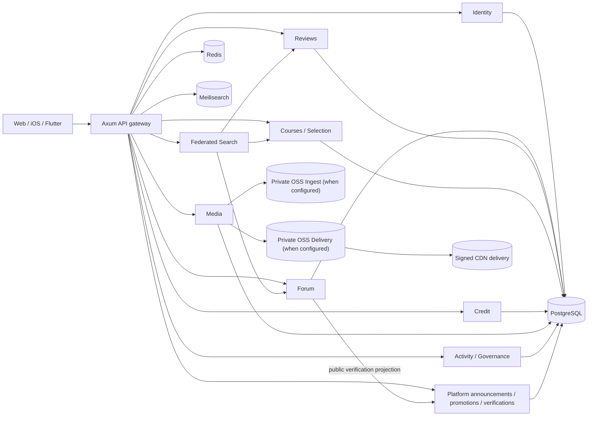

# 系统概览与域边界

> 文档类型：架构规范
>
> 状态：Active
>
> 负责人：Platform maintainers
>
> 最近核验：2026-07-12，migrations `0060`–`0062`、domain workers 与 ADMIN/委派授权边界

YourTJ 是 Rust/Axum 后端与 React Web 的 monorepo。论坛、课程、评课、选课、积分共享身份和
PostgreSQL，但每个 domain 仍拥有自己的表、业务规则和 HTTP routes。

## 当前运行结构



PostgreSQL 是业务事实源。Redis 用于限流、缓存和热计数；Meilisearch 是可重建搜索投影。仓库
实现了 Alibaba OSS private Ingest/Delivery 与 signed CDN provider boundary，但代码或 migration 不能
证明某个部署已经配置双 bucket/RAM/CDN；启用时对象和 edge cache 仍是派生物，业务可见性由 PostgreSQL
moderation/publication/binding 决定。

## Crate 与所有权

| Crate | 所有权 | 不应承担 |
|---|---|---|
| `api` | 进程启动、router composition、middleware、跨域 wiring | 新增领域 SQL 或独立业务状态机 |
| `identity` | accounts、email auth、password、sessions、keys、角色/制裁身份边界 | forum 关系、公开内容 |
| `courses` | catalogue、teacher、department、selection mirror、课程搜索 | review 正文和治理决定 |
| `reviews` | 课评、反应、举报与课评审核 | 直接更新 course/identity 私有表 |
| `credit` | append-only ledger、wallet projection、受控 escrow/tip/bounty | 充值、提现、自由转账 |
| `forum` | boards、threads、comments、votes、subscriptions、notifications、DM | 校园邮箱与密码 |
| `media` | upload intent、OSS callback、moderation/publication、private Delivery variants、typed signed projection、binding、operational hold、durable processing/cleanup 与 rollout-gated GC | 任意业务内容本身、通用跨账号可见性或 legal-hold policy |
| `activity` | contribution/check-in facts、daily/account score projection、score/trust policy 与 durable evaluator | 从源表在读路径临时聚合 |
| `governance` | 跨域 append-only audit、申诉状态/历史、当事人治理通知 | 代替各域原处置状态或自行恢复内容/制裁 |
| `platform` | 公告、用户 receipt、首页推广、人工认证 definition/grant 与 runtime settings | 业务域外的任意 gateway SQL |
| `search` | 聚合 course/review/thread typed results、查询边界与限流 | 自有业务表、原始索引文档或跨 schema SQL |
| `shared` | config、errors、auth primitives、pagination、cache/rate-limit helpers | domain SQL 或反向依赖 |
| `e2e` | 可执行旅程测试 harness | 生产路由或测试替身进入业务 crate |

跨域读取/写入通过 owner crate 的 public API 或明确的 read model。`shared` 不依赖任何 domain；
`api` 只负责组合。公告、推广和 runtime settings 已迁入独立 `platform` crate；当前
`api/src/onebox.rs` 和部分 admin handler 仍包含业务 SQL/外部内容处理，是已知架构债务。人工认证已经
由 `platform` owner 提供 public projection；新增成就后台、typed settings 或 durable jobs 时继续建立
明确 owner domain，而不是扩大 gateway 例外。

## 仓库边界

```text
backend/                 Rust workspace 与 migrations
web/                     React + TypeScript Web
contract/openapi.yaml    HTTP wire contract
docs/                    产品、架构、开发、运维与安全规范
tools/d1/                D1 选课快照导入工具
.github/workflows/       CI、PR preview 与 main staging 部署
.agents/skills/          仓库级 Codex 工作流
```

iOS 与 Flutter 在独立仓库，只消费 OpenAPI 生成的类型和平台 HTTP 接口。

## 当前部署与目标架构

- `Current`：GitHub Actions 通过 SSH 把 main 和 PR preview 部署到共享测试服务器；preview 有独立
  路径和后端容器/数据库编排，详见[部署与 PR Preview](../operations/deployment-and-previews.md)。
- `Target`：Aliyun 华东的无状态容器、PolarDB PostgreSQL、Redis/Tair、Meilisearch、OSS + CDN；
  SAE/SLB/ECS 的最终 IaC 尚未在 `infra/` 落地。

目标部署不能被文档写成已经上线的生产事实。上线前还需要 secret manager、network policy、
备份恢复、RPO/RTO、SLO 和正式域名/ICP 运行手册。

## 同步与一致性边界

- 业务 mutation 与自身表、必要 counter、activity event、governance audit 尽可能在一个事务提交。
- 治理处置/申诉 transition 与当事人 notice 同事务；申诉终态通过 owner crate public adapter 恢复精确
  identity/forum/reviews 状态，整条 composition 共用事务。commit 后的 cache/search 修复失败可重试，
  但任何无法安全判断的后续状态在决定前 fail closed。
- Governance audit/appeal history 在 PostgreSQL 拒绝 row mutation 和 table truncate；comment reversal
  统一 thread→comment lock 并在锁后读取 parent state。Production runtime role 不拥有这些表，也不能
  disable trigger；migration owner 只用于受控 rollout。
- 普通通知与 identity security email 已使用 transactional/durable job + lease/retry/dead-letter，治理
  notice 继续与处置/申诉同事务；Redis/SSE 只提供刷新提示。Media variant processing/ordered cleanup 与
  activity daily evaluator 也已持久化；搜索和重型 reconciliation 仍有进程内/fire-and-forget 路径，应
  标为 `Partial`。
- 公开搜索必须在返回前应用数据库可见性/隐私 policy；索引不能扩大权限。
- Profile authored-content 聚合由 Forum 提供，但 profile/activity/mention policy 仍归 Identity；Forum
  通过 owner public projection 或 batch API 取得最小 policy，再结合自己的 follow/block/mute 事实。
  公共论坛内容的 canonical route 与 profile activity list 是两个独立授权 surface。
- `search` 只并行编排 owner crate public API；courses/reviews/forum 各自按候选 id 回 PostgreSQL
  重建结果，避免 gateway 或聚合层拥有他域 SQL。
- 缓存使用版本化 key/短 TTL；失效失败不得改变数据库事实。
- 任何跨域后台汇总优先 read model，不让 `api` 直接形成越来越大的跨 schema join。

## 硬性不变量

- 公共身份与校园邮箱分离；新 PII 必须有用途、保护、保留和删除答案。
- 资金类写入验证 Ed25519 signing intent/signature/replay protection；ledger 在应用与数据库层
  append-only 且可验证，task/purchase 转换使用 row lock + CAS。
- 积分无充值、提现、法币兑换或自由 transfer。
- Media 业务只引用已授权 asset；第三方 URL 不是可信业务事实。
- Staff 操作按服务端 effective capability、target hierarchy/ceiling、reason 和 audit 授权。目标模型中 ADMIN
  拥有所有平台定义的 staff capability，普通管理员只使用 ADMIN 给予的 account-scoped grant；当前静态
  role mapping 迁移前不能宣称已实现委派。
- 利益冲突默认 no-self；当前仅 ADMIN 的本人媒体审核有显式确认 + recent-auth + reason + trusted preview +
  专用 audit 例外，不改变申诉 recusal、append-only 审计、DM/PII 最小化和 credit 合规边界。普通管理员
  委派本身仍为 `Planned`。
- Revision history 只向作者本人或严格高于另一作者角色的内容审核 staff 返回，并使用有界 cursor page。
- 公共 API 使用 `/api/v2`、camelCase DTO、稳定错误 envelope 和有界分页。

详细工程规则见 `AGENTS.md` 和[契约、数据与派生投影](contracts-and-data.md)。
