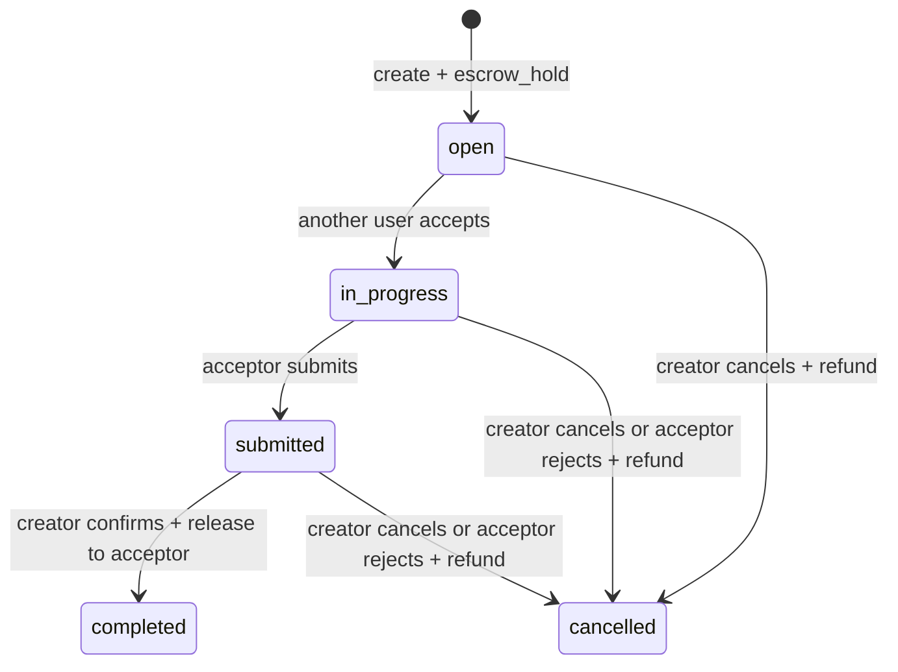
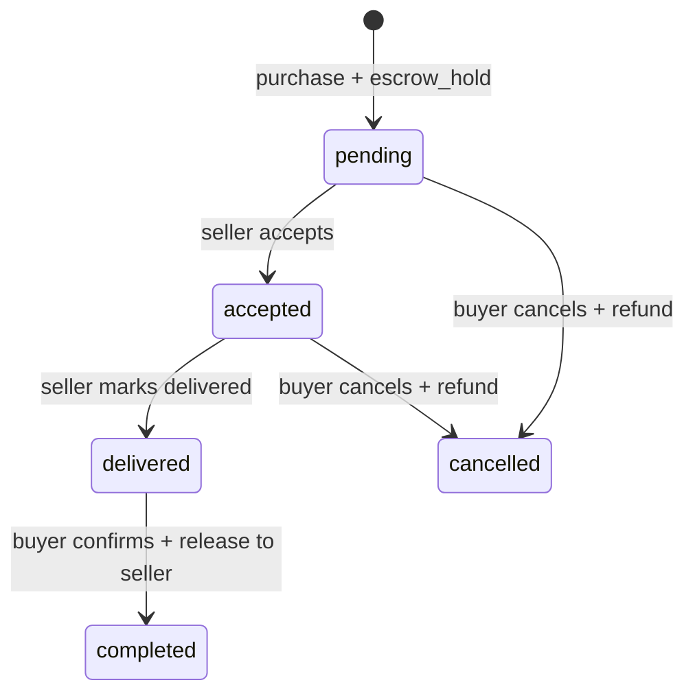

# 闭环积分、内容打赏与托管交易

> 文档类型：产品规范
>
> 状态：Active
>
> 负责人：Credit maintainers、Product owner、Security owner
>
> 最近核验：2026-07-17，Web/Flutter wallet signing、owner export/purge 与 ledger/reconcile 边界

积分是用户贡献产生、只在 YourTJ 内使用的虚拟权益，不是货币。系统不提供充值、提现、法币
兑换或无理由自由转账。HTTP 结构以 `contract/openapi.yaml` 为准，本规范只定义业务语义。

## 当前能力与边界

- `Current`：system-signed mint、近期认证保护的首次 Ed25519 公钥绑定、一次性 signing intent、hash-chain ledger、
  wallet projection、内容打赏、悬赏任务和商品托管。
- `Current`：ledger 新写入只允许 `mint`、`tip`、`escrow_hold`、`escrow_release`；应用写路径不能
  update/delete 历史 ledger。
- `Current`：任务和订单转换在事务内锁行并 compare-and-set；并发请求只有符合当前状态的一条
  能提交，release 与 hold 清理同事务完成。
- `Current`：公开 verify 与受 `credit.integrity` 独立 capability 保护的运营 reconcile 均已存在；
  reconcile 持久保存请求原因、状态、账本快照、逐钱包比较和聚合漂移指标，管理 UI 只读展示。
- `Current`：只有系统确认的自动贡献成就首次授予可写入幂等 pending mint；管理员人工授予成就永不
  mint，撤销成就也不删除、冲销或重写已经产生的 ledger entry。
- `Current`：`GET /wallet` 向账号本人返回 Identity 拥有的 active public key。Web 只使用与该 key
  精确匹配、按 API environment + account 隔离的 non-extractable WebCrypto private key；旧版
  `localStorage` seed 只有在派生公钥精确匹配时才迁入 IndexedDB，持久提交后才删除原 seed。
- `Current`：Web 与 Flutter 都在发送 value-moving 请求前持久保存 operation digest + intent id；网络无响应
  或 5xx 时只读取 owner intent outcome。该读取以 `FOR SHARE` 等待消费事务的 `FOR UPDATE`，所以
  `committed` 只在业务事务提交后可见，`expired` 只在没有在途 consumer 且未消费时返回。Web 还会在任何
  网络 preflight/intent 前以 IndexedDB `add` 原子认领 operation digest，并用 claim id 条件更新/删除；并发
  标签页至多一个越过发送边界，已确认提交的短期 tombstone 阻止迟到竞争方。
- `Current`：owner export 包含本人创建/接受的 task、创建的 product 和本人参与的 purchase；不可逆账号 purge 会
  幂等清空本人 task contact 和 product delivery instructions，同时保留 ledger、escrow 状态与必要交易事实。
- `Current`：所有 Credit owner write（包括 signing intent）都在业务 transaction 的第一组数据库锁中，通过
  Identity owner API 按 account id 排序取得 active、未 suspend 账号的 `FOR SHARE` lifecycle barrier；账号
  删除/封禁的 `FOR UPDATE` 必须等这些在途写入提交后才能继续，随后单次 owner purge 不会被迟到私密字段写回。
  同时涉及 actor/counterparty 的 tip、accept、purchase 会先无锁读取候选身份，再一次排序锁双方，最后锁定并
  重验 Credit/content entity，避免 reciprocal 操作形成 account→entity→account 死锁。
- `Decision needed`：账号进入 `deletion_requested` 后无法认证 Credit，而已开始的 task/purchase
  尚无删除前结清或 durable settlement。新的 accept/purchase 会在同一事务内确认 creator/seller
  仍 active 且未 suspend，但这不能解决已存 hold；完整决策跟踪为 `SYS-AUDIT-11`。
- `Partial`：持久结果尚未接告警通知、SLO 和受审批的 projection 重建流程；当前发现异常只留证和
  升级处理，不自动改账。
- `Partial`：钱包密钥轮换和丢失恢复尚无 old-key proof、双人审核恢复或独立安全事件模型；服务端只允许
  首次绑定和同一规范公钥的幂等确认。客户端清除或丢失唯一私钥后，value-moving 写入会 fail closed，
  余额和历史 ledger 不受影响，但不能只凭登录态换绑新钥。
- `Partial`：non-extractable WebCrypto key 防止把 raw private key 从浏览器存储中导出，但不能阻止已经
  成功执行的同源 XSS 调用签名；CSP、依赖审查、富文本安全与 refresh credential 迁移仍是独立安全边界。
- `Partial`：signing intent 仍缺 account-scoped active quota、过期未消费记录的 durable retention worker，
  credit task/product 输入也需要统一的 contract 长度上限；在这些边界完成前不能把 intent storage 宣称为
  可长期无界承载。
- `Partial`：Flutter 已用服务端 exact signing bytes 和共享 Ed25519 vector 完成 wallet/task/product/
  purchase/tip 旅程，并在 value-moving 请求前持久化 account+environment 隔离的 intent record；未知结果
  只接受 lock-aware owner outcome，pending/超时/错误继续阻止重放。该边界已有 repository/fake-server
  回归，但仍缺真实 backend 断线/长事务 integration 与 Android/iOS secure-storage/backup 真机验证。

### 钱包公钥登记

- `/wallet/bind` 必须绑定当前未撤销 session 的 recent-auth；首次登记时 body 的 canonical `accountId` 必须
  与 bearer 账号精确相同，客户端必须把同一账号的 token/session generation 固定到实际 dispatch。兼容
  旧客户端的无 `accountId` body 只能幂等确认 bearer 账号已经存在且完全相同的 active key，绝不能首次
  登记或换 key。普通 bearer、旧 session 或 appeal/recovery credential 都不能登记公钥。
- Bind 在事务内先独占锁定 actor account，并在 lifecycle/sanction 等待后复核 active/no-effective-suspend。
  Claim-challenge 先经过每账号 10 次/10 分钟的 Redis bucket，再以 actor `FOR UPDATE` barrier 在同一事务
  替换旧 challenge；数据库 unique index 保证每账号最多一条。Legacy claim 以 actor `FOR SHARE` barrier
  作为第一组锁，并受 account 10 次/10 分钟与 opaque network/global bucket 保护。Canonical UUID/hash/signature
  在查询前校验；第一条格式正确的 proof attempt 会消费有效 challenge，失败统一返回 generic error，且缺
  link/key 仍执行 dummy verify。成功时才在同一事务写 link/review owner、清空已认领 review 的旧 hash/edit
  token、执行 claim mint。账号关闭先赢时不得产生迟到 wallet 写；writer 先赢时关闭流程必须等待提交，最终 purge 删除
  challenge/已归属 legacy link 并撤销 active key，但保留 ledger 验证所需历史 key row。
- 每个账号最多一把 active key。Migration `0067` 按变更前 signing-intent 的运行事实冻结
  `created_at DESC, public_key DESC` 的最新 key，把其余历史 key 标记 revoked，并用 partial unique index
  阻止旧 writer、并发请求或应用缺陷再次产生第二把 active key。历史 key 保留用于 ledger 验证。
- 相同 Ed25519 bytes 先规范化为标准 base64，再幂等返回；不同 active key 返回 conflict。后续 rotation
  不能复用这个 endpoint，必须另行设计 old-key 签名或可审计恢复、通知、冷却期和撤销语义。
- `/wallet` 的 `activePublicKey` 只是当前账号 owner-visible verification projection，不是私钥或换绑
  authority。客户端在每次签名前必须与本机 record 精确比较；字段缺失、record 损坏、账号/环境不匹配
  或 WebCrypto/IndexedDB 不可用都 fail closed。
- 此迁移无法判断部署前某把现行 key 是否曾由被盗 session 绑定；上线前需要审查异常多 key 账号，
  可疑账号走人工安全处置，而不是自动猜测真正 owner。

## 参与者与可见性

- Content tipper：只能打赏当前可见的 review/thread/comment，收款人必须是该内容作者。
- Content author：账号必须存在、active，且没有有效 suspend sanction；不能给自己打赏。
- Task creator / acceptor：联系方式只向 creator 和已接单 acceptor 返回；creator 不能接自己的任务。
- Product seller / buyer：公开 Product 不返回 `deliveryInfo`；该字段只通过 buyer/seller 可访问的
  Purchase response 返回。订单 action 与签名 intent 在读取状态、双方或金额前先做 party scope；第三方对
  存在和不存在的订单都只得到 `NOT_FOUND`，不能把任一入口当作枚举 oracle。
- System signer：只负责贡献 mint 和 escrow release，不代表人工余额编辑入口。
- Achievement operator：可以管理展示定义和 lower-role 账号的人工荣誉，但不能通过该入口发积分；
  `mintAmount` 只供代码中的自动贡献规则读取。
- Credit integrity operator：只有管理员默认拥有独立 `credit.integrity` capability；moderator、普通
  用户和仅有通用 job capability 的账号不能运行或读取钱包比较结果。

邮箱、私钥、签名凭证和完整 signing payload 不进入公共 DTO、日志或审计 metadata。账号删除后，
ledger 只保留满足验证与合规所需的不可反查 identity/tombstone。

## 状态机

终态不能再次 release。`hold_tx_id` 在 active 状态标识待处理托管，在 completed/cancelled 提交时
原子清空。库存永不为负；最后一件购买成功后商品进入 `sold_out`。Pending/accepted 订单取消时，退款、
订单终态与一件库存恢复在同一事务提交；由最后一件预占触发的 `sold_out` 恢复为 `on_sale`，运营明确设置的
`off_sale` 保持不变。同一订单并发取消只能退款和恢复库存一次。

## 并发、失败与恢复

- 所有 task/purchase 转换读取 `FOR UPDATE` 锁定后的最新状态，并以 expected status 的 CAS 更新；
  affected rows 不是 1 时返回 conflict。
- 签名 intent 绑定 action、request、actor 和创建时实体快照；状态已变化的旧 intent 不可重放。订单 intent
  只为当前状态下允许该 actor 签署的 confirm/cancel 创建，不能预先泄露或签署无权执行的订单转换。
- ledger append、wallet projection、库存、订单/任务状态和 hold 处理在同一数据库事务提交。
- 订单取消先以 purchase row lock/CAS 取得唯一终态，再在获取 ledger advisory lock 前锁 product 并恢复
  一件库存，最后 append refund；整个事务失败则三者一起回滚。该顺序避免 product/wallet 锁反转，也使
  同一订单并发取消无法重复补库存或退款。
- debit 与 release 共用全局 ledger advisory lock，并始终在任何 wallet `FOR UPDATE` 之前获取；该顺序是
  事务正确性约束，不得在新的 value-moving flow 中反转。tip/task debit 的签名余额 snapshot 也必须在
  该 advisory + wallet lock 内复核；等待期间发生的 mint/release 会使旧 intent 失效，而不是在新余额上提交。
- open task 删除会退款，因此需要并消费签名 intent；cancelled task 已无 hold，删除不移动价值且不创建
  intent。`cancel` 只能 creator 发起，`reject` 只能当前 acceptor 发起，二者不能互换审计语义。
- API 超时后客户端查询 owner intent outcome，不能盲目生成另一笔 value-moving 请求。相同 intent/
  idempotency key 只对应同一请求；只有明确 4xx rejection 可直接视为未提交，2xx 响应反序列化失败、3xx、
  无响应、5xx、`pending` 或 outcome 查询错误都不是未提交证明。
- Flutter 的 pending reconciliation 记录写入 Keychain/Keystore-backed storage；它不保存 seed、raw request、
  signature、signing bytes 或 idempotency key，只保存 deterministic operation digest、action、intent id/expiry。
  账号切换不删除不确定操作；回到同一 environment+account 后继续 outcome 查询。记录损坏或读写失败时
  fail closed，不能提供“忽略并重试”绕过。
- Web record 按 API environment + account 隔离，只有 operation digest、claim phase/id、action、intent id/
  expiry。`preparing` 在任何网络调用前原子创建，只有持有同一 claim id 的上下文能转为 `submitted` 或删除；
  成功/authoritative committed 转为短期 `committed` tombstone，`expired` 或明确未提交才清除。它不保存
  raw request、signature、signing bytes、access token 或 idempotency key。
- reconcile 请求必须带理由与 `Idempotency-Key`；服务端只保存 key hash，相同 operator/key/reason
  返回同一 run，不同 reason 冲突。同一时刻只有一个 queued/running run，数据库 advisory lock
  防止多实例重复扫描；中断后可用理由化 resume 继续同一 run，已经终态的 run 只返回原结果而不会重跑。
- run 在一致性快照中先验证完整 hash chain、canonical payload 和签名。验证失败时记录失败序号并
  停止钱包推导，避免把不可信 ledger 当作修复依据。
- 验证通过后，以 ledger 计算每个账号 `received - sent`、最后参与序号，并与 wallet cache 做 full
  outer comparison；不存在的 wallet、余额差和 `last_seq` 差分别计数，数值以十进制字符串返回以
  避免浏览器整数精度丢失。
- reconcile 只向自己的结果表和 governance audit 写入证据；不 update/insert wallet，不 append/update/
  delete ledger。发现漂移只告警；未来若提供 projection 重建，必须是独立审批和审计流程。
- 任务错误只持久化稳定 bounded error code；日志和 audit metadata 不包含数据库错误、签名、邮箱、
  idempotency key 或完整请求体。

## 验收底线

- self-tip、错误 recipient、隐藏/删除/不存在 target、失效 recipient 均被拒绝且不改变余额。
- task self-accept、double accept、accept/deliver 与 cancel 竞态不会双重解决。
- public Product 永不含 delivery instructions；Purchase 仅订单双方可见。
- list 严格拒绝非法 cursor/limit，并用 `limit + 1` 准确计算 `hasMore`。
- 每条 value journey 后 ledger verification 通过，wallet projection 与 ledger 重算一致。
- 非 recent-auth session 不能首次绑定；并发不同 key 只有一把成功，同 key 重试幂等，不同 key 不能
  仅凭登录态轮换；签名 intent 只使用数据库唯一 active key。
- Web 旧 seed 只有在派生公钥匹配 owner-visible active key 后才能迁移；匹配迁移、跨账号/环境隔离、
  durable-write 失败、exact-byte vector 和不确定响应重载核验均有负向回归。
- Owner export 覆盖本人创建/接受的 task、创建的 product 与参与的 purchase 私有投影；重复 purge 后交易对手不能再读取被删除账号拥有的
  contact/delivery fields，而对手自己拥有的信息、ledger 与 escrow transaction facts 不被误删。
- 普通用户/moderator 无法运行、列出或读取 reconcile；管理员重复请求幂等，同类并发请求被拒绝。
- drift、缺 wallet、篡改 ledger 和任务失败均产生可区分的持久状态；任何路径都不改变余额或 ledger。
- 人工成就授予、撤销和重新授予不产生 pending mint；重复自动贡献授予只产生一个幂等 mint。
