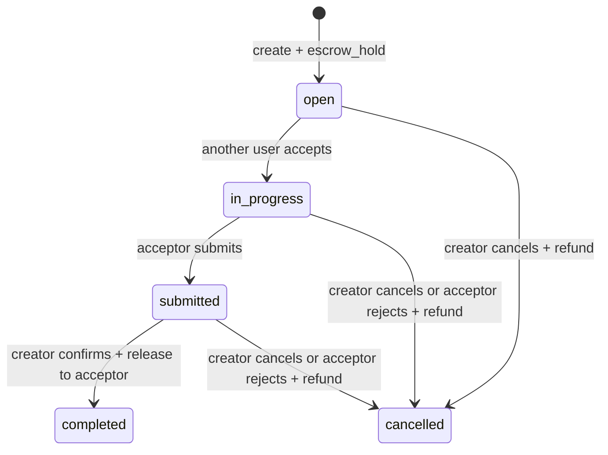
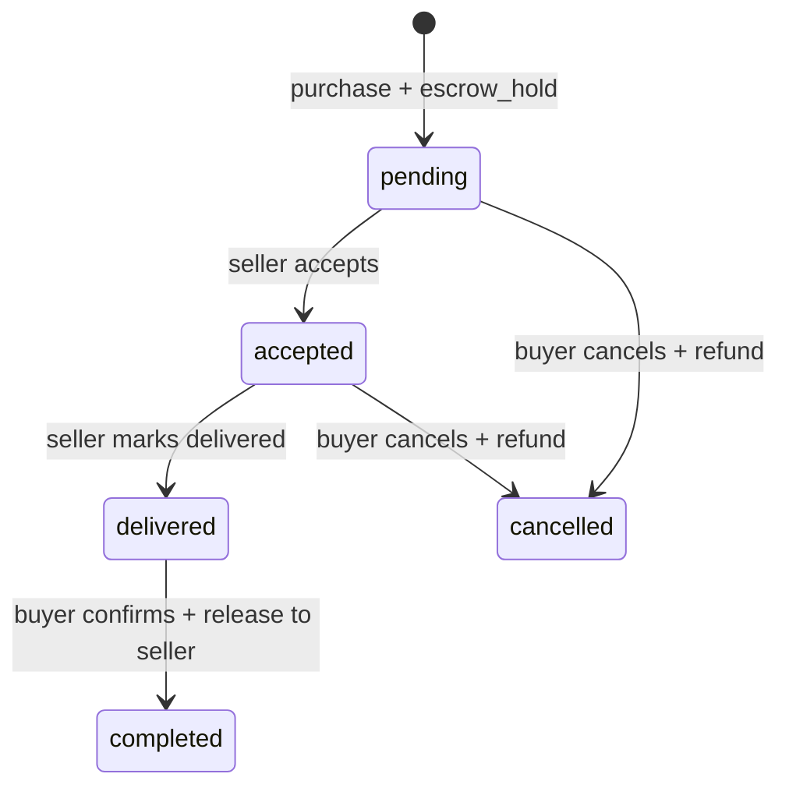

# 闭环积分、内容打赏与托管交易

> 文档类型：产品规范
>
> 状态：Active
>
> 负责人：Credit maintainers、Product owner、Security owner
>
> 最近核验：2026-07-12，`codex/x-credit-reconciliation`

积分是用户贡献产生、只在 YourTJ 内使用的虚拟权益，不是货币。系统不提供充值、提现、法币
兑换或无理由自由转账。HTTP 结构以 `contract/openapi.yaml` 为准，本规范只定义业务语义。

## 当前能力与边界

- `Current`：system-signed mint、绑定 Ed25519 公钥、一次性 signing intent、hash-chain ledger、
  wallet projection、内容打赏、悬赏任务和商品托管。
- `Current`：ledger 新写入只允许 `mint`、`tip`、`escrow_hold`、`escrow_release`；应用写路径不能
  update/delete 历史 ledger。
- `Current`：任务和订单转换在事务内锁行并 compare-and-set；并发请求只有符合当前状态的一条
  能提交，release 与 hold 清理同事务完成。
- `Current`：公开 verify 与受 `credit.integrity` 独立 capability 保护的运营 reconcile 均已存在；
  reconcile 持久保存请求原因、状态、账本快照、逐钱包比较和聚合漂移指标，管理 UI 只读展示。
- `Partial`：持久结果尚未接告警通知、SLO 和受审批的 projection 重建流程；当前发现异常只留证和
  升级处理，不自动改账。

## 参与者与可见性

- Content tipper：只能打赏当前可见的 review/thread/comment，收款人必须是该内容作者。
- Content author：账号必须存在、active，且没有有效 suspend sanction；不能给自己打赏。
- Task creator / acceptor：联系方式只向 creator 和已接单 acceptor 返回；creator 不能接自己的任务。
- Product seller / buyer：公开 Product 不返回 `deliveryInfo`；该字段只通过 buyer/seller 可访问的
  Purchase response 返回。第三方不能枚举订单。
- System signer：只负责贡献 mint 和 escrow release，不代表人工余额编辑入口。
- Credit integrity operator：只有管理员默认拥有独立 `credit.integrity` capability；moderator、普通
  用户和仅有通用 job capability 的账号不能运行或读取钱包比较结果。

邮箱、私钥、签名凭证和完整 signing payload 不进入公共 DTO、日志或审计 metadata。账号删除后，
ledger 只保留满足验证与合规所需的不可反查 identity/tombstone。

## 状态机

终态不能再次 release。`hold_tx_id` 在 active 状态标识待处理托管，在 completed/cancelled 提交时
原子清空。库存永不为负；最后一件购买成功后商品进入 sold-out。

## 并发、失败与恢复

- 所有 task/purchase 转换读取 `FOR UPDATE` 锁定后的最新状态，并以 expected status 的 CAS 更新；
  affected rows 不是 1 时返回 conflict。
- 签名 intent 绑定 action、request、actor 和创建时实体快照；状态已变化的旧 intent 不可重放。
- ledger append、wallet projection、库存、订单/任务状态和 hold 处理在同一数据库事务提交。
- API 超时后客户端先重新读取状态；不能盲目生成另一笔 value-moving 请求。相同 intent/idempotency
  key 只对应同一请求。
- reconcile 请求必须带理由与 `Idempotency-Key`；服务端只保存 key hash，相同 operator/key/reason
  返回同一 run，不同 reason 冲突。同一时刻只有一个 queued/running run，数据库 advisory lock
  防止多实例重复扫描；中断后可用理由化 resume 继续同一 run，已经终态的 run 只返回原结果而不会重跑。
- run 在一致性快照中先验证完整 hash chain、canonical payload 和签名。验证失败时记录失败序号并
  停止钱包推导，避免把不可信 ledger 当作修复依据。
- 验证通过后，以 ledger 计算每个账号 `received - sent`、最后参与序号，并与 wallet cache 做 full
  outer comparison；不存在的 wallet、余额差和 `last_seq` 差分别计数，数值以十进制字符串返回以
  避免浏览器整数精度丢失。
- reconcile 只向自己的结果表和 governance audit 写入证据；不 update/insert wallet，不 append/update/
  delete ledger。发现漂移只告警；未来若提供 projection 重建，必须是独立审批和审计流程。
- 任务错误只持久化稳定 bounded error code；日志和 audit metadata 不包含数据库错误、签名、邮箱、
  idempotency key 或完整请求体。

## 验收底线

- self-tip、错误 recipient、隐藏/删除/不存在 target、失效 recipient 均被拒绝且不改变余额。
- task self-accept、double accept、accept/deliver 与 cancel 竞态不会双重解决。
- public Product 永不含 delivery instructions；Purchase 仅订单双方可见。
- list 严格拒绝非法 cursor/limit，并用 `limit + 1` 准确计算 `hasMore`。
- 每条 value journey 后 ledger verification 通过，wallet projection 与 ledger 重算一致。
- 普通用户/moderator 无法运行、列出或读取 reconcile；管理员重复请求幂等，同类并发请求被拒绝。
- drift、缺 wallet、篡改 ledger 和任务失败均产生可区分的持久状态；任何路径都不改变余额或 ledger。
