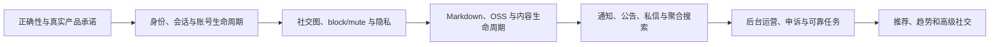

# 当前能力、缺口与路线图

> 文档类型：实现盘点与产品路线图
>
> 状态：Active
>
> 负责人：Product owner、Platform maintainers
>
> 最近核验：2026-07-12，`codex/governance-integrity` 与 owner-domain tests

本盘点以当前源码、OpenAPI、migration 和 Web 为基线。它说明已经存在什么、哪里只有骨架、
哪些界面承诺与实际行为不一致。后续 PR 改变这些结论时，必须在同一 PR 同步更新本文件的
跨域摘要和对应领域规范。

## 已有的坚实基础

- Rust/Axum 单库多域后端、PostgreSQL、Redis、Meilisearch 与 OSS 上传信任边界。
- 校园邮箱验证码、JWT/refresh、后端密码登录与找回、角色与制裁检查。
- 课程、选课镜像、课评、论坛板块/主题/评论/投票/收藏/订阅/标签/草稿/修订。
- 活跃度事件、每日计数和管理员可版本化权重；首页热力图使用真实接口。
- canonical 1:1 私信、未读指针、双向发送阻断、单条举报和最小化后台证据。
- capability RBAC、用户邀请、角色/禁言/封禁、会话撤销、多域审核、审计和管理 UI。
- 论坛搜索候选由 PostgreSQL 重新验证可见性，索引可以全量重建。
- 积分 ledger 有 signing intent、hash chain、数据库 append-only 防护；tip 与 escrow 状态机有
  target/party 校验、事务锁和 CAS，Web 使用服务端返回的 exact signing bytes。

这些基础降低了下一阶段成本，但不能掩盖用户主流程和语义仍未闭环。

## 当前关键差距

| 领域 | 状态 | 已验证问题 |
|---|---|---|
| 登录注册 | `Current` | purpose-bound 一次性 code、密码防枚举与 reset/change 撤销语义已完成；Web 已拆分密码、验证码、注册和找回流程，注册要求显式公开 handle |
| 账号与会话 | `Partial` | session-bound access、refresh replay 防护、Web 设备中心和 10 分钟 server-side recent-auth 已完成；仍缺 onboarding、自助导出/停用/删除，refresh token 仍存 localStorage |
| 社交图 | `Current` | 已有公开单向 follow、幂等接口、owner remove-follower、followers/following、relationship API 与 trigger 维护的准确计数；移除关注者不等于 block，第一阶段明确不做私密账号审批 |
| block/mute | `Current` | mute 为单向私密 feed/通知过滤，block 为双向安全边界并原子移除双方 follow；profile、feed、通知、DM、回复与投票已接统一规则 |
| 个人资料 | `Partial` | display name、bio、HTTPS website、clean OSS avatar/banner reference、owner 上传/状态恢复/绑定 UI、关系数和 profile/list/DM/discoverability/activity/mention 隐私已落地；Profile 提供 `canViewActivity` 私密状态，mention 按接收方 policy 批量授权；仍缺 handle history 和公开 media/likes tabs |
| 内容正确性 | `Partial` | 主题/评论 canonical policy 和事务边界已完成；tags/exact filter、有效 subscription、poll/vote/bookmark viewer state、read tracking 与撤销互动已接齐并有 handler→DB 验证；draft 与已发布内容均使用 CAS version，revision/canonical 原子，revision history 使用层级授权、有界 cursor 和 batch media projection，DTO 返回服务端 author/moderation 权限；仍缺显式 pending 和 durable outbox |
| Trust/板块权限 | `Partial` | promotion 已检查 active-days，单次扫描至多升降一级；create-thread 在预检和写事务内执行 board lock/min-trust，`moderation.content` 只豁免这两个 gate；仍需确定 staff 被普通举报自动隐藏政策并把 trust policy 版本化 |
| 创作体验 | `Partial` | 主题/评论已持久化显式 content format，Web 已接 CodeMirror 编辑/预览、安全 renderer、debounced 云端草稿和 clean OSS 图片插入；作者可编辑/软删除已发布内容，跨设备冲突保留本地输入并显式恢复；仍缺跨客户端 conformance |
| Link preview/Onebox | `Partial` | 已实现 HTTPS、逐跳 allowlist/DNS/public-IP pin、流式 body 上限、HTML5 parser、安全 UTF-8、规范化 URL、无远程预览图、成功/失败 TTL cache 和最小化日志；仍缺完整的受控 HTTPS 网络 fixture，若未来展示预览图还需 media proxy |
| 媒体 | `Partial` | 后端 STS、回调、owner-only 状态查询及 clean avatar/banner/thread/comment binding 已存在；审核执行严格角色层级，同一 reviewer 的可信图片预览是 approve 前置，file/PDF 在 scanner 前 fail closed，pending/clean block 会先 quarantine 再由 durable job 在事务外删除 OSS 并重试/dead-letter。Forum 有 exact AST/reference、versioned usage、delete/restore grace 和 Web 状态 UI。课评/私信仍无 binding，且缺 scanner/缩略图/EXIF/配额/实际 orphan GC worker/CDN 策略 |
| Feed | `Partial` | latest/hot/subscriptions/following 已拆分真实后端语义，following 基于 user_follows 并执行账号/内容/block/mute 过滤；列表已有 canonical 摘要与 viewer state，首页和论坛页均以明确“加载更多”控件消费稳定游标；仍缺透明的 recommended 规则 |
| 聚合搜索 | `Partial` | courses/reviews/threads/users/boards/tags 已由独立 search domain 返回 typed、可跳转且回表重验的结果；type/limit、query+scope 绑定的有界 cursor、all→单类“查看更多”、局部失败保真和 Web 综合页已生效；仍缺 highlight/纠错与可靠 outbox 更新 |
| 通知 | `Partial` | bounded cursor/unread/逐条与全部已读、安全站内 target、Web 角标/筛选/SSE 回源刷新已接通；typed event×channel 偏好及 weekly digest 开关已由 OpenAPI、写入点和设置页对齐，治理通知另有与处置事务同成败的 private store、角标和申诉 target；仍有部分旧互动事件无 target，也没有 multi-instance delivery/outbox |
| 公告 | `Current` | 有状态、排期、受众、严重度、presentation、version/revision、seen/dismiss/ack receipt、全局未看弹窗、公告页和后台 revision history；匿名访客用 revision-scoped 本地 seen，登录用户以服务端 receipt 为准 |
| 私信 | `Partial` | canonical 1:1、DM policy、单条陌生请求、incoming/sent 请求箱、accept/decline/withdraw/report、独立 unread/request 角标、幂等/限流/冷却、archive/delete/recover、搜索、mute 和最小举报证据已接通；仍缺附件、request expiry、typing/presence、多实例实时及 retention/legal-hold worker |
| 推广位 | `Partial` | 左侧已由 API 返回明确标识的自营站内推广，具备 clean owned asset id、状态、排期、受众、位置、优先级、独立 capability、审计和后台 UI；两小时无身份展示票据、50%/500ms 曝光门槛、点击补曝光、幂等日聚合、48 小时 receipt 清理及后台汇总/趋势已完成，仍缺匿名素材图和 asset usage/GC |
| 徽章与认证 | `Partial` | 成就徽章、人工身份/特殊认证和实时角色标识已经拆分；成就具备独立 capability、versioned 受控定义、自动幂等授予/mint、人工非 mint 授予、撤销/重新授予、append-only history、同事务审计、后台 UI 与公开投影。人工认证具备 typed definition、可到期/撤销 grant、私有 evidence reference、后台 UI 与安全公开投影；仍缺成就/认证通知、自动授予 durable outbox 和认证证据存储/复核政策 |
| 治理 | `Partial` | 账号/论坛/课评处置已有当事人通知、30 天一次申诉、受限账号 purpose-bound access、拒绝 update/delete/truncate 的 append-only history、SQL 分页前 hierarchy/recusal、独立复核 capability 与 owner-domain 原子撤销/缩短；comment overturn 使用 thread→comment lock 并保留 media rebind；角色/suspend/强制注销已有 session-bound recent-auth；仍缺 assignment/SLA、证据工作台、账号生命周期、保留 worker、Staff WebAuthn/MFA 和双人审批 |
| 积分运营 | `Partial` | 用户侧 verify、内容打赏和 escrow 完整性已加固；持久化只读 reconcile、单并发/幂等执行、逐钱包漂移指标、独立 capability、审计和管理视图已接通；仍缺告警/SLO 与受审批 projection 重建，历史 constraint anomaly 需单独兼容策略 |
| 运维 | `Partial` | 设置仍为 string key/value；任务只确认提交，无持久状态、进度、失败日志和重试；缺 SLO/恢复演练 |
| 测试 | `Partial` | 后端 CI 有 lint/集成，Web 有 lint/type/build 与最小 Vitest/Testing Library/axe harness；仍无浏览器 E2E、完整前端覆盖，许多契约与 UI 行为差异无法被 CI 捕获 |

Web shell 已采用路由级 lazy loading、可朗读 loading state、受控页面/操作反馈动画和
`prefers-reduced-motion` 降级；这只建立了体验基础，不代表各业务页面已完成视觉与旅程验收。

## P0：先恢复正确性、安全与产品真实性

1. 主题/评论 canonical policy、评论 SQL、引用约束、事务边界、versioned typed draft 与已发布内容
   `contentVersion/expectedVersion` 已完成；下一步补显式 pending 和 durable side-effect outbox。
2. Onebox 的维护中 HTML5 parser、规范化 URL 和短期错误缓存已完成；下一步补完整的受控 HTTPS
   网络 fixture。现有逐跳 scheme/allowlist/DNS/public-IP pin、流式 body 限制和禁用远程预览图继续
   作为安全基线；只有产品决定展示图片时才引入 media proxy。
3. Trust active-days/单步升降、board lock/min-trust、tags/filter/subscription/viewer/read/cancel 和
   伪 UI 清理已完成；下一步明确 staff 内容达到普通举报阈值时自动隐藏还是升级复核，并将 trust
   policy 版本化。
4. typed 通知偏好和 Web SSE 已对齐；下一步补齐所有 target URL、durable outbox 和 multi-instance delivery。
5. 公告 revision/seen/ack 和全局未看弹窗已完成；继续为公告受众、强制确认和保留期限形成运营政策。
6. 任意头像 URL 已停写，avatar/banner/thread/comment 已完成上传、状态恢复和 clean binding UI；下一步
   接课评/私信并完成 scanner/variants/GC/CDN。后台只通过一次性审计同源代理预览，不展示 object
   key/hash/vendor URL，并如实说明 block 会永久删除对象。
7. 六类 typed 聚合搜索已补 query/scope 绑定 cursor、240 条窗口、all→单类续页和局部失败状态；
   下一步补可靠 outbox/reconciliation、highlight/纠错。User discoverability、profile visibility、
   block/mute 和账号状态继续作为服务端硬边界。
8. 为上述身份、通知、内容、搜索和公告行为补 handler→DB 与前端关键旅程验证。
9. credit 只读 reconcile job、指标和管理视图已完成；下一步接告警/SLO，并为确需重建的 wallet
   projection 设计独立审批流程。历史 constraint anomaly 走单独兼容决策，不在 migration 中改写
   ledger，也不提供 balance editor 或任意 ledger append。

## P1：形成完整社区闭环

- 已完成用户 follow graph、relationship API、粉丝/关注列表、owner remove-follower、准确计数与公开账号
  第一阶段状态机；私密账号审批若进入后续版本仍需独立产品决策和 pending 状态机。
- Follow/subscription/mute/block 已拆分，profile/list/new-DM/discoverability/activity/mention 与账号搜索
  隐私已实现；下一步补 likes/media activity tabs 和全站浏览器验证。
- Display name、bio、banner、受控链接和 OSS 头像 binding 已落地；下一步补 handle history/cooldown、
  scanner/variants 和 orphan GC。
- `plain_v1/markdown_v1` 契约、安全 renderer、编辑器、预览、CAS autosave、已发布内容冲突恢复和
  clean Forum 图片已完成；下一步补跨客户端 conformance corpus、scanner/variants 与真实浏览器旅程。
- 现有 latest/hot/subscription/following feed 和 typed 搜索已补 Web 游标续页；下一步完成搜索
  highlight/纠错。
- DM policy、单消息请求状态机、archive/delete/recover 已完成；下一步补 private attachment、request
  expiry 与 retention/legal-hold worker。
- 推广 asset usage/GC、成就/认证通知和证据复核、typed settings、durable job center。
- 治理通知与申诉闭环已完成基础链路；下一步补 reviewer assignment/SLA/evidence access policy，以及
  账号导出/停用/删除/恢复。
- notification/search/media/activity outbox 与 reconciliation，多实例实时广播。
- 对齐并验证现有 weekly digest 的 preference、投递状态、retry 和运营指标。

## P2：增长和高级社交

- 有透明输入和安全过滤的 recommended feed、趋势与关注建议。
- 独立短动态、repost/quote-post；不复用公共论坛隐私语义硬凑。
- 私密账号审批、搜索个性化、digest 个性化、typing/presence 和 group DM。
- 推广位实验/归因政策、复杂 audience targeting 和更丰富的身份认证流程；基础匿名日聚合不扩展为
  跨域个人画像。

## 依赖顺序

推荐、转发和群聊不是当前最短路径。没有社交图、隐私、通知和治理基础时，它们只会放大
错误数据、骚扰和运营成本。

## 决策门

在开始相应 schema/API 前，产品负责人必须确认：

- 匿名与校园成员的默认可见范围。
- follow 是否仅影响 feed/DM，block 与 mute 的全站语义。
- 密码登录标识、毕业账号恢复和首次注册是否强制设置密码。
- Markdown 支持的内容类型和历史纯文本兼容方式。
- OSS private/public、签名 URL、审核前发布和媒体保留策略。
- 推广位是否仅自营、各认证类型的具体证据/复核/保留政策、管理员恢复机制。
- 数据导出、删除恢复窗、举报证据/审计/备份保留期。

## 核验入口

本盘点主要核对 `backend/crates/identity`、`forum`、`reviews`、`media`、`activity`、
`governance`、`platform`、`contract/openapi.yaml`、`web/src/pages`、
`web/src/components`、`web/src/lib/api` 和 `.github/workflows`。不要把本文件当作 API 或 schema
字段清单；对应细节仍以契约和 migration 为准。
