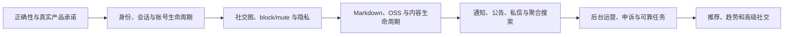

# 当前能力、缺口与路线图

> 文档类型：实现盘点与产品路线图
>
> 状态：Active
>
> 负责人：Product owner、Platform maintainers
>
> 最近核验：2026-07-15，migrations `0053`–`0068`、selection 真实备份基线、OpenAPI/Web/Flutter 与 CI workflows

本盘点以当前源码、OpenAPI、migration 和 Web 为基线。它说明已经存在什么、哪里只有骨架、
哪些界面承诺与实际行为不一致。后续 PR 改变这些结论时，必须在同一 PR 同步更新本文件的
跨域摘要和对应领域规范。

Flutter Android/iOS 现已进入同一 monorepo，但仍以 Web 和 OpenAPI 的已验证行为为对齐基线；工程
存在、能编译或显示 shell 都不能自动把对应产品旅程标为完成。

## 已有的坚实基础

- Rust/Axum 单库多域后端、PostgreSQL、Redis、Meilisearch 与 OSS 上传信任边界。
- 校园邮箱验证码、JWT/refresh、后端密码登录与找回、角色与制裁检查。
- 课程、选课镜像、课评、论坛板块/主题/评论/投票/收藏/订阅/标签/草稿/修订。
- 活跃度事件、每日签到/计数、账号 score projection、管理员可版本化四项权重和 durable trust evaluator；
  首页签到与热力图使用真实接口。
- canonical 1:1 私信、未读指针、双向发送阻断、单条举报和最小化后台证据。
- 静态 role→capability RBAC、用户邀请、角色/禁言/封禁、会话撤销、多域审核、审计和管理 UI。
- 论坛搜索候选由 PostgreSQL 重新验证可见性，索引可以全量重建。
- 积分 ledger 有 signing intent、hash chain、数据库 append-only 防护；tip 与 escrow 状态机有
  target/party 校验、事务锁和 CAS，Web 使用服务端返回的 exact signing bytes。

这些基础降低了下一阶段成本，但不能掩盖用户主流程和语义仍未闭环。

## 当前关键差距

| 领域 | 状态 | 已验证问题 |
|---|---|---|
| 登录注册 | `Current` | purpose-bound 一次性 code、只用密码登录、首次设置/修改/找回密码的原子 session replacement 与防枚举已完成；Web 已拆分密码、验证码、注册和找回。密码/邀请安全邮件进入不保存收件人/正文的 durable job、lease/retry/dead-letter，而验证码发送仍同步确认 provider 接受 |
| 账号与会话 | `Partial` | session-bound access、refresh replay、防 stale-password recent-auth、同源 installation 摘要下的重复登录 session replacement/30 活跃上限、focused onboarding、recovery-only credential、30 天停用/删除恢复、八域 owner export/purge、durable worker 与 Web 自助入口已完成；仍缺完整跨标签 refresh single-flight、versioned policy publish、handle history、legal-hold/备份/OSS 全闭环，refresh token 仍存 localStorage，JWT signing key rotation/多 key 验证尚未交付 |
| 社交图 | `Current` | 已有公开单向 follow、幂等接口、owner remove-follower、followers/following、relationship API 与 trigger 维护的准确计数；移除关注者不等于 block，第一阶段明确不做私密账号审批 |
| block/mute | `Current` | mute 为单向私密 feed/通知过滤，block 为双向安全边界并原子移除双方 follow；profile、feed、通知、DM、回复与投票已接统一规则 |
| 个人资料 | `Partial` | display name、默认同济大学且 owner 可编辑的院校、bio、HTTPS website、clean + published avatar/banner reference、owner 上传/状态恢复/绑定 UI、关系数和 profile/list/DM/discoverability/activity/mention 隐私已落地；Profile 提供 `canViewActivity`，posts/replies/media/likes 与 owner bookmarks 使用真实稳定分页和互动状态。仍缺 handle history，且 public profile/account/relationship/search/DM avatar 兼容字段尚未携带签名 URL expiry/统一错误刷新 |
| 内容正确性 | `Partial` | 主题/评论 canonical policy 和事务边界已完成；tags/exact filter、有效 subscription、poll/vote/bookmark viewer state、read tracking、直接回复数/赞数与撤销互动已接齐并有 handler→DB 验证；draft 与已发布内容均使用 CAS version，revision/canonical 原子，revision history 和 profile media 使用 owner 授权的 batch media projection；通知 side effect 已使用 durable outbox，仍缺显式 pending 与搜索等其余可靠投影 |
| Trust/板块权限 | `Current` | 统一 1–6 信任等级由 `activity` domain 基于发帖/评论/点赞/签到的 lifetime qualifying score 自动评定；每日 durable evaluator 每次最多升级一级，版本化四项权重、阈值、like 日上限和降级冷却由后台管理，策略变更会重投影。手动 override 不被自动评估改写，治理降级后还需冷却结束及新的有效贡献；board gate 仍独立生效 |
| 创作体验 | `Partial` | 主题/评论已持久化显式 content format，Web 已接 CodeMirror 编辑/预览、安全 renderer、debounced 云端草稿和 clean + published 图片插入；Flutter 也已接安全 renderer、云端草稿/冲突与上传，backend/Web/Flutter 共同消费恶意样例 corpus。Owner pending preview/processing 状态可恢复；Flutter 创作预览、历史 iOS corpus 和跨端真实 journey 仍缺 |
| Link preview/Onebox | `Partial` | HTTPS 抓取边界已有逐跳 allowlist/DNS/public-IP pin、禁用代理、精确 HTML MIME/UTF-8、流式 body 上限、HTML5 parser、规范化 URL、无远程预览图、版本化成功/失败 cache 和不访问公网的受控 TLS fixture；Web 尚未消费 `/onebox`，若未来展示预览图还需 media proxy |
| 媒体 | `Partial` | 代码已交付 private Ingest → bounded decode/metadata stripping → private Delivery 三变体 → 五分钟 signed CDN 的 publication pipeline；新 JPEG/PNG/WebP callback 当前默认由 system policy 审计后自动进入 processing，可按环境回退 pending + 可信预览人工审核。Owner pending preview、ADMIN 受控自审、Forum attachment/author avatar 与 Promotion typed projection、processing retry 和 block 后 ordered cleanup 均保留。Profile/list avatar 兼容 DTO 的 expiry/refetch 尚未统一；通用 GC 默认关闭，目标环境双 bucket/RAM/CDN/secrets、真实 smoke 与 inventory reconciliation 尚需签字；内容安全自动扫描、课评/私信 binding、file/PDF scanner 与 legal hold 仍待决 |
| Feed | `Partial` | latest/hot/subscriptions/following 已拆分真实后端语义，following 基于 user_follows 并执行账号/内容/block/mute 过滤；列表已有 canonical 摘要、typed 作者头像与 viewer state，首页和论坛页会刷新临期或加载失败的头像、以独立灯箱查看 attachment，并用明确“加载更多”控件消费稳定游标；仍缺透明的 recommended 规则 |
| 聚合搜索 | `Partial` | courses/reviews/threads/users/boards/tags 已由独立 search domain 返回 typed、可跳转且回表重验的结果；type/limit、query+scope 绑定的有界 cursor、all→单类“查看更多”、局部失败保真、安全 canonical 字符区间高亮、保守拼写建议和 Web 综合页已生效；仍缺拼音/别名与可靠 outbox 更新 |
| 选课与课表 | `Partial` | `jcourse-db-backup` 已通过受限 export/import 管线在隔离 PG 中完成真实投影、抽样和性能验证；`selection` 以 teaching-class `offeringId`、显式周次/未知标记、有界游标和时间筛选对外，Web/Flutter 以同一 identity 管理 client-owned 课表。全量物化、Meili/Redis 切换已进入 durable 幂等 job，Web 可查看状态与安全重试。上游仍无官方选中结果/可靠变更源，跨设备课表同步待决，浏览器与真机端到端 journey 仍缺 |
| 通知 | `Partial` | 论坛/互动/关注/DM/成就/认证 producer 与业务事实同事务写 0054 outbox，consumer 有 lease/SKIP LOCKED、幂等 receipt、聚合、当前 privacy/prefs/content 与可撤销 source generation 重验、自动重试/dead-letter、理由化人工重试；target、Redis 多实例 SSE hint、账号/受限凭证分区 Web cache 已完成。治理通知继续使用同处置事务 private store；仍缺 digest delivery status/retry、dead-letter 告警/SLO 与外部渠道运营验证 |
| 公告 | `Current` | 有状态、排期、受众、严重度、presentation、version/revision、seen/dismiss/ack receipt、全局未看弹窗、公告页和后台 revision history；队列等待 auth/onboarding 初始化后才选择匿名本地 seen 或登录用户服务端 receipt，避免身份切换时重复/漏弹 |
| 私信 | `Partial` | canonical 1:1、DM policy、单条陌生请求、incoming/sent 请求箱、accept/decline/withdraw/report、独立 unread/request 角标、幂等/限流/冷却、archive/delete/recover、搜索、mute、durable 多实例刷新提示和最小举报证据已接通；仍缺附件、request expiry、typing/presence 及 retention/legal-hold worker |
| 推广位 | `Partial` | 左侧由 API 返回明确标识的自营站内推广，具备 clean + published asset、原子 binding/解绑 grace、状态、排期、受众、位置、优先级、独立 capability、审计和后台 UI；匿名列表通过 Platform 授权后的 typed Delivery 返回短期图片，两小时无身份票据、曝光/点击幂等日聚合与后台趋势已完成。目标 CDN 尚需 staging 验收，排期重叠预警仍缺 |
| 徽章与认证 | `Partial` | 成就徽章、人工身份/特殊认证和实时角色标识已经拆分；成就具备独立 capability、versioned 受控定义、durable 自动幂等授予/mint、人工非 mint 授予、撤销/重新授予、append-only history、同事务审计、通知、后台 UI 与公开投影。人工认证具备 typed definition、可到期/撤销 grant、排期到期/撤销取消通知、私有 evidence reference、后台 UI 与安全公开投影；仍缺认证证据对象存储/复核政策 |
| 治理 | `Partial` | 账号/论坛/课评处置已有当事人通知、申诉、append-only history、SQL 分页前 hierarchy/recusal 与 owner-domain 原子撤销；账号生命周期有 session-bound recent-auth、不可逆 purge marker 和 lease fence。当前 ADMIN 已有唯一媒体自审例外（显式确认 + recent-auth + reason + approve preview evidence + self-block fail-closed + audit），其他对象保持 no-self。普通管理员逐账号 grant/revoke/expiry、细分审核 capability、assignment/SLA、证据工作台、通用 legal hold、Staff WebAuthn/MFA 和双人审批仍未交付 |
| 积分运营 | `Partial` | 用户侧 verify、内容打赏和 escrow 完整性已加固；持久化只读 reconcile、单并发/幂等执行、逐钱包漂移指标、独立 capability、审计和管理视图已接通；仍缺告警/SLO 与受审批 projection 重建，历史 constraint anomaly 需单独兼容策略 |
| 运维 | `Partial` | PR/main 使用仓库内 versioned deploy/Nginx 脚本，PR 1–999 有独立数据库/容器、`.pgpass` 无密码 DSN 和不可变 frontend release 回滚；新脚本把 app 直连端口限制为 loopback，main 有 rollback/readiness/HTTPS 外部探针及 Cloudflare trusted-CIDR source-IP restoration。2026-07-12 server audit 证明旧 main/PR `15xxx/16xxx` 仍 bind all-interface，而 DB/Redis/Meili 已是 loopback；loopback app 修复、cloud firewall review 和外部负向复测是 release gate。Provider secrets/smoke、job center、告警、SLO、host-key pin 与恢复演练仍缺 |
| Flutter Android/iOS | `Partial` | `mobile/` 已作为 proprietary clean-room 工程进入 monorepo；固定 Dart generator/typed client、自适应五项 shell、secure session、账号/环境隔离、共享 Markdown/Ed25519/OSS signing vectors 已落库。身份、首页/推广、论坛/媒体、课程/评课/teaching-class 本机课表、搜索/资料、通知/全局公告、私信、申诉/生命周期、钱包以及 capability 管理中心都已消费真实 API；selection 本地 schema v2→v3、同课平行教学班、分页/取消竞态与显式周次冲突已有回归。19 项矩阵仍缺不同程度的后端契约、读侧 UX、golden/integration/device、hosted link association、release signing 和商店发布证据，因此均为 `Partial`，不能整体宣称 Web parity |
| 测试 | `Partial` | 后端 CI 有 lint/集成；Web CI 有 generate/test/lint/type/build 与最小 Vitest/Testing Library/axe harness；Flutter CI 配置 Dart client drift、format/analyze/unit-widget 与 Android/iOS build，内容 renderer、wallet exact bytes 和 OSS V4 已消费共享 fixture。仍无浏览器 E2E、移动端 golden/真实环境 integration/device journey、自动依赖许可证/secret scan 和完整前端覆盖，许多系统生命周期与无障碍差异仍无法被 CI 捕获 |

Web shell 已采用路由级 lazy loading、可朗读 loading state、受控页面/操作反馈动画和
`prefers-reduced-motion` 降级；这只建立了体验基础，不代表各业务页面已完成视觉与旅程验收。

## P0：先恢复正确性、安全与产品真实性

1. 主题/评论 canonical policy、评论 SQL、引用约束、事务边界、versioned typed draft 与已发布内容
   `contentVersion/expectedVersion`、通知 side-effect outbox 已完成；下一步补显式 pending 和搜索/媒体
   等剩余 projection outbox。
2. Onebox 的维护中 HTML5 parser、规范化 URL、版本化缓存和受控 HTTPS 网络 fixture 已完成；逐跳
   scheme/allowlist/DNS/public-IP pin、禁用代理、精确 MIME/charset、流式 body 限制和禁用远程预览图
   继续作为安全基线。下一步是在不自动请求正文中的任意链接前提下设计 Web opt-in 预览旅程；只有
   产品决定展示图片时才引入 media proxy。
3. 统一信任等级 1–6 已由 activity domain 完成签到/贡献 score projection、每日 durable 单步升级、
   board lock/min-trust、举报权重映射、手动覆盖保护、版本化权重/阈值与降级后再升级门槛；下一步明确
   staff 内容被普通举报自动隐藏时是继续自动隐藏还是升级复核队列，以及哪些 upheld 治理事件触发降级。
4. typed 通知偏好、target、durable outbox、账号分区 Web cache 和 multi-instance SSE refresh 已对齐；
   下一步接 dead-letter 告警/SLO 和 digest delivery status/retry。
5. 公告 revision/seen/ack 和全局未看弹窗已完成；继续为公告受众、强制确认和保留期限形成运营政策。
6. 任意头像 URL 已停写，avatar/banner/thread/comment/promotion 已完成 private Ingest、owner/status
   recovery、clean + published binding、sanitized variants 与 owning-domain signed Delivery。当前默认只对
   受支持 raster callback 执行有审计的 system auto-approval，仍由 private processing 完成实际安全变体；
   下一步先按 runbook 完成 staging 双 bucket/CDN/rotation/reconciliation，再接内容安全自动扫描、课评/私信
   和 file/PDF scanner。后台回退人工审核只通过一次性审计同源代理预览，不展示 object key/hash/vendor URL；
   block 立即停止签名并持久执行 purge/Delivery/Ingest cleanup。
7. 六类 typed 聚合搜索已补 query/scope 绑定 cursor、240 条窗口、all→单类续页、局部失败、安全高亮和
   仅从已回表可见结果推导的保守拼写建议；下一步补可靠 outbox/reconciliation、拼音和别名。User discoverability、profile visibility、
   block/mute 和账号状态继续作为服务端硬边界。
8. 为上述身份、通知、内容、搜索和公告行为补 handler→DB 与前端关键旅程验证。
9. credit 只读 reconcile job、指标和管理视图已完成；下一步接告警/SLO，并为确需重建的 wallet
   projection 设计独立审批流程。历史 constraint anomaly 走单独兼容决策，不在 migration 中改写
   ledger，也不提供 balance editor 或任意 ledger append。
10. 密码登录、修改/重置撤销和 durable security email 已完成；剩余身份 P0 是把 refresh credential 从
    localStorage 迁到 HttpOnly cookie 并同时设计 CSRF/跨标签同步，以及交付 JWT signing-key rotation、
    多 key 验证和故障演练。不能因核心密码业务已可用而关闭这两个独立安全缺口。
11. Shared staging 旧 main/PR app port 绑定 `0.0.0.0` 是 merge/release blocker。本 revision 将自己启动的
    frontend/backend 改为 loopback 并校验；operator 还须 review cloud firewall，并从独立外部网络证明
    所有运行中 `15xxx/16xxx` 直连失败，同时保持 canonical HTTPS/health/readiness 正常。DB/Redis/Meili
    已由 server-side `ss` 证明 loopback，继续防回归但不误报为当前公网暴露。

## P1：形成完整社区闭环

- Flutter 已按 typed API/secure session/账号隔离、semantic theme、自适应 shell，再到普通用户与
  capability 管理旅程的依赖顺序接入真实服务；下一步不是继续堆页面，而是先补评课 viewer/edit、公告
  历史、头像 expiry 等 contract/read-side 缺口，再完成 golden、真实环境 integration、Android/iOS device、
  verified links 和 release 证据。19 项 matrix 在这些门槛前继续保持 `Partial`。
- Dart OpenAPI generator 已固定版本、校验和、配置与生成输出，CI regenerate 并检查 diff clean；共享
  Markdown、wallet Ed25519 exact bytes 和 OSS V4 signing fixture 已由相关客户端/服务消费。后续 consumer
  继续使用 typed client，不能用手写 DTO 或 dynamic map 绕过 contract。
- 已完成用户 follow graph、relationship API、粉丝/关注列表、owner remove-follower、准确计数与公开账号
  第一阶段状态机；私密账号审批若进入后续版本仍需独立产品决策和 pending 状态机。
- Follow/subscription/mute/block 已拆分，profile/list/new-DM/discoverability/activity/mention 与账号搜索
  隐私已实现；likes/media/owner-bookmarks tabs 已接真实内容投影，下一步做全站浏览器验证。
- Display name、bio、banner、受控链接、OSS 头像 binding 与 retention-aware orphan GC 代码/测试已落地；
  GC 仍需按 runbook 完成 rollout reconciliation 后逐环境启用。下一步补 handle history/cooldown、
  file/PDF scanner 和 private DM delivery。
- `plain_v1/markdown_v1` 契约、安全 renderer、编辑器、预览、CAS autosave、已发布内容冲突恢复和
  clean + published Forum 图片已完成；backend/Web/Flutter 已消费共享 conformance corpus。下一步补
  Flutter 创作预览、历史 iOS consumer、file/PDF scanner、provider 配置验收与真实 browser/device 旅程。
- 现有 latest/hot/subscription/following feed 和 typed 搜索已补 Web 游标续页、安全 canonical 高亮与
  保守拼写建议；下一步完成拼音/别名和可靠索引更新。
- DM policy、单消息请求状态机、archive/delete/recover 已完成；下一步补 private attachment、request
  expiry 与 retention/legal-hold worker。
- 认证证据复核、typed settings 和统一 durable job center；推广图片匿名交付已完成，仍需排期重叠预警
  与 CDN staging 验收。
- 治理通知、申诉与账号导出/停用/删除/恢复已完成基础链路；purge 在 owner cleanup 前持久写不可逆
  marker，并等待 Media durable deletion 达到可安全终止状态；耗尽任务可审计 requeue。下一步补 reviewer assignment/SLA/evidence access policy、legal hold、
  统一 operator UI/job center 和 backup/OSS deletion rehearsal。
- ADMIN 媒体自审专用确认/recent-auth/audit 已交付；下一步落地普通管理员授权：拆分过宽的审核
  capability，交付 assignment/grant/revoke/expiry/history、authorization version/session 失效和管理 UI。
- 搜索可靠 outbox，以及 search/media/activity 的定期 reconciliation；通知 outbox、多实例实时刷新、
  Media processing/cleanup 和 Activity evaluator 已交付 durable 基础。
- 对齐并验证现有 weekly digest 的 preference、投递状态、retry 和运营指标。

## P2：增长和高级社交

- 有透明输入和安全过滤的 recommended feed、趋势与关注建议。
- 独立短动态、repost/quote-post；不复用公共论坛隐私语义硬凑。
- 私密账号审批、搜索个性化、digest 个性化、typing/presence 和 group DM。
- 推广位实验/归因政策、复杂 audience targeting 和更丰富的身份认证流程；基础匿名日聚合不扩展为
  跨域个人画像。

## 依赖顺序

推荐、转发和群聊不是当前最短路径。没有社交图、隐私、通知和治理基础时，它们只会放大
错误数据、骚扰和运营成本。

## 决策门

在开始相应 schema/API 前，产品负责人必须确认：

- 匿名与校园成员的默认可见范围。
- 若未来引入私密账号，follow request 的 pending/拒绝/撤销与既有公开 follow 迁移语义；当前 follow 只
  影响 feed/DM 且 block/mute 全站边界已确定。
- 毕业账号恢复、handle history/cooldown 和首次注册是否强制设置密码；当前密码登录标识已确定为校园邮箱。
- Markdown 支持的内容类型和历史纯文本兼容方式。
- Private DM/file delivery、Ingest 原图保留和 legal hold release；公共媒体的 private Ingest/Delivery、
  审核后发布与五分钟 CDN bearer URL 已确定。
- 推广位是否仅自营、各认证类型的具体证据/复核/保留政策、管理员恢复机制。
- 数据导出的字段/短期 artifact、30 天删除恢复窗已落地；仍需确认举报证据、审计、公共内容、OSS、
  cache/log 和备份的具体保留期及 legal-hold 机制。

## 核验入口

本盘点主要核对 `backend/crates/identity`、`forum`、`reviews`、`media`、`activity`、
`governance`、`platform`、`contract/openapi.yaml`、`web/src/pages`、
`web/src/components`、`web/src/lib/api` 和 `.github/workflows`。不要把本文件当作 API 或 schema
字段清单；对应细节仍以契约和 migration 为准。
